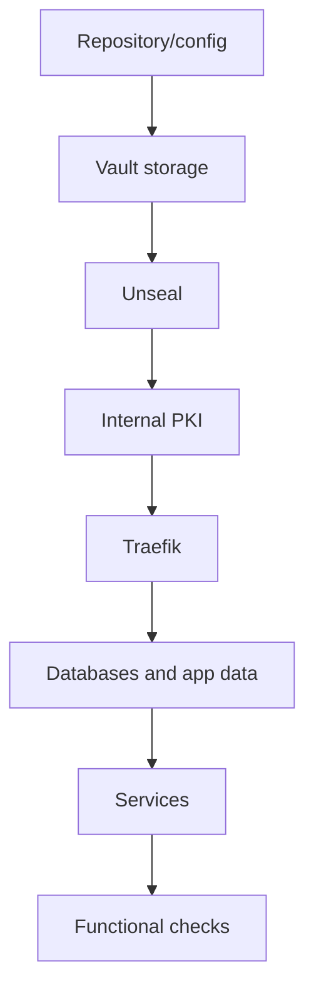

# Backup and Restore Baseline

## Current State

The repository contains local persistent data and Docker volumes, but it does not yet contain an orchestrated backup system.

This baseline documents what should be considered for backup without introducing new runtime tools.

## Data to Protect

Vault:

- `core/vault/file`
- configuration `core/vault/config/vault.hcl`
- operational unseal/root token material stored outside the repository or in a secure location.

Traefik and PKI:

- `core/traefik/traefik.yml`
- `core/traefik/dynamic/`
- `pki/ca/`
- `pki/issued/`

Services:

- Docker volumes declared in Compose files.
- `services/*/data` directories, where present.
- `services/identity/var` directory.
- service PostgreSQL/MariaDB databases.
- application configuration in `services/*/config`.

## Restore Baseline

Logical restore order:

1. Restore repository and configuration files.
2. Restore Docker network `proxy`.
3. Restore Vault storage.
4. Start Vault and unseal it.
5. Restore PKI and certificates.
6. Start Traefik.
7. Restore databases and application data.
8. Start application services.
9. Verify routes, login, and identity flows.

## Mandatory TODOs

TODO: define backup format for PostgreSQL and MariaDB databases.

TODO: define backup retention and encryption.

TODO: define periodic restore testing.

TODO: document where to store unseal keys and tokens without placing them in the repository.

TODO: decide whether `pki/issued` is reconstructable or must always be restored.
