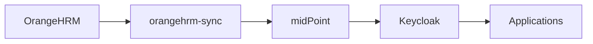

# Identity Flow: HR, midPoint, Keycloak

## Implemented Flow

The repository implements the following model:

- OrangeHRM is the HR source.
- `orangehrm-sync` reads HR data from the OrangeHRM database and upserts users into midPoint.
- midPoint applies templates, roles, organizational assignments, and provisioning.
- The family-lab midPoint objects define a Keycloak connector for accounts, groups, and privileged accounts.
- Nextcloud has OIDC-related configuration for Keycloak in the repository; other application integrations should use Keycloak where possible, but they are not all fully codified here.

## orangehrm-sync

`services/identity/orangehrm-sync/orangehrm-sync.py`:

- reads employees from OrangeHRM tables.
- builds deterministic OIDs from employee numbers.
- uses `org-mapping.json` to connect HR subunits to midPoint organizations.
- marks HR-managed assignments with description `managed-by-orangehrm-sync:org`.
- uses midPoint REST to create or update users and assignments.
- supports `DRY_RUN` through an environment variable.

The organizations mapped in the repository are:

- `Family`
- `Core`
- `Children`
- `Extended`

TODO: document the actual environment variables from the `.env` file without copying sensitive values.

## family-lab Example

`services/identity/examples/family-lab/` contains midPoint objects that can be imported with `docker-compose.tools.yml`.

The philosophy behind the example is to use a family as a mini-organization to validate an enterprise model:

- people come from HR, not from manual application administration.
- the organizational structure is modeled as authoritative data.
- application access is modeled as reusable roles, not local exceptions.
- Keycloak groups are managed by midPoint.
- administrative access is separated from daily accounts.
- administrative accounts use dedicated naming, `adm_<username>`.
- the privileged account may remain present for audit continuity, but is disabled when the entitlement is not active.
- privileged enablement is modeled separately from privileged account creation.
- sensitive roles can be made requestable and approvable.

This makes the lab useful even though the names are domestic: `Family`, `Core`, `Children`, and `Extended` are a proxy for a real tenant with organizational units, standard users, application groups, and controlled administration.

## Main family-lab Objects

Existing categories:

- `orgs/`: `Family`, `Core`, `Children`, `Extended` organizations.
- `roles/010-030`: application user roles `passwords-user`, `files-user`, `hr-user`.
- `roles/040-050`: organizational group provisioning and Keycloak user account provisioning.
- `roles/060-084`: managed Keycloak groups for organizations, apps, and admins.
- `roles/100-140`: application admin roles for files, HR, passwords, auth, and identity.
- `roles/150-151`: persistent Keycloak admin account and temporary enablement.
- `roles/200-210`: security validator and catalog-reader.
- `roles/900-910`: global admin request and global admin.
- `templates/000-user-template.xml`: default user template.
- `resources/010-idp-keycloak.xml`: Keycloak resource.
- `patches/`: system configuration patches for secret provider, user template, and role catalog.

## Standard and Privileged Accounts

The user template assigns active users:

- end user role.
- catalog access.
- `IDP_ACCOUNT_USER` role to create the standard account in Keycloak.

The admin model separates:

- `IDP_ADMIN_ACCOUNT`: creates and keeps the `adm_<username>` admin account.
- `IDP_ADMIN_ACCOUNT_ENABLED`: temporarily enables the admin account when rights are active.

In the Keycloak resource, the `admin` intent produces username `adm_<username>` and an email address with `adm_` prefixed to the local part where possible.

## Keycloak

The midPoint `IDP Connector` resource points to:

- `https://auth.internal`
- realm `sovereign`
- client `midpoint-provisioner`
- external secret through provider `local-file-secrets`

TODO: document Keycloak realm, OIDC client, and token mapper bootstrap if they are managed outside the repository.
