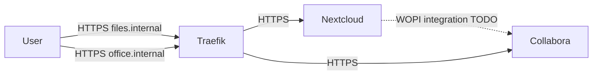

# Nextcloud and Collabora

## Nextcloud

`services/nextcloud/docker-compose.yml` defines:

- `nextcloud` with image `nextcloud:31-apache`.
- `nextcloud-db` with PostgreSQL 16.
- `nextcloud-redis` with `redis:7-alpine`.
- `nextcloud-cron` with entrypoint `/cron.sh`.
- `vault-agent` to generate secret files.

Relevant configuration:

- internal public host: `files.internal`.
- internal TLS mounted from `pki/issued/files.internal`.
- internal CA mounted in the container.
- Redis used for distributed cache and locking.
- upload limit set to `10G`.
- PHP memory set to `1024M`.
- custom configuration in `services/nextcloud/config/nextcloud/zz-custom.config.php`.

The custom configuration includes:

- `defaultapp = files`.
- trusted domain `files.internal`.
- HTTPS overwrite URL.
- locale `it_IT` and timezone `Europe/Paris`.
- OIDC toward `https://auth.internal/realms/sovereign`.
- groups read from claim `nextcloud_groups`.

TODO: document how the Nextcloud OIDC app is installed/configured if that configuration is manual.

## Collabora

`services/collabora/docker-compose.yml` defines:

- `collabora` with image `collabora/code:25.04.9.4.1`.
- `vault-agent` for TLS, CA, and admin credentials.

Relevant configuration:

- `domain: files\.internal`.
- `aliasgroup1: https://files.internal:443`.
- SSL enabled in the Collabora container.
- SSL termination disabled on the Collabora side, so Collabora serves HTTPS toward Traefik.
- certificate, key, and CA read from files generated in `services/collabora/secrets`.
- `net.post_allow.host` allows `files.internal` and `nextcloud`.

TODO: document the Nextcloud-side configuration that connects Collabora/office.internal if it is not managed in the repository.

## Valkey Target State

Redis is present only as Nextcloud cache/locking. The future target is Valkey; see [ADR 0004](adr/0004-redis-to-valkey-target.md).
