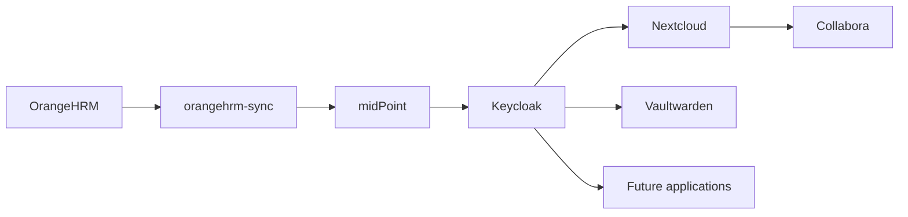
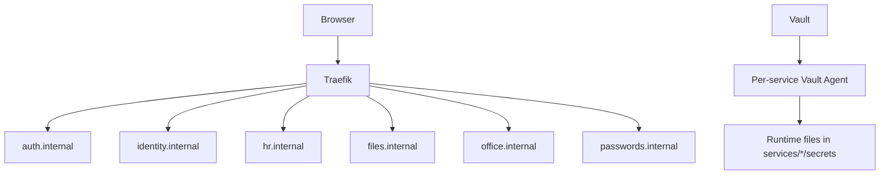

# Overview

Lab Sovrano is a local lab for a sovereign, self-hosted workplace platform. The repository contains Docker Compose configuration, Traefik routing, Vault, internal PKI, application services, and identity governance bootstrap objects.

## Implemented Repository State

Components present:

- Traefik as reverse proxy.
- HashiCorp Vault as the current secret manager.
- Vault PKI certificate issuance is used by the operational scripts, but the full PKI bootstrap is not codified in this repository.
- OrangeHRM as HR source.
- midPoint as lifecycle and provisioning engine.
- Keycloak as identity provider.
- Nextcloud for files and collaboration.
- Collabora Online for document editing.
- Vaultwarden for password management.
- PowerShell scripts for certificate issuance, service registration, certificate renewal, and Vault unseal.

Future or target components, mentioned but not implemented in the repository:

- k3s as orchestrator.
- OpenBao as the Vault migration target.
- Valkey as the Redis migration target.
- ITSM, chat, video meetings, wiki, email, calendars, and tasks.
- Orchestrated backup and complete observability.

## Logical Architecture

## Local Control Plane

## Principles Documented by the Repository

- Docker Compose is the current operational format.
- Services share the external Docker network `proxy`.
- Runtime secrets are made available through Vault Agent and local templates.
- Main Traefik routes are YAML files in `core/traefik/dynamic`.
- Internal certificates are stored under `pki/issued/<hostname>`.
- The `pki/` directory contains sensitive or generated material and must not be copied into documentation.
