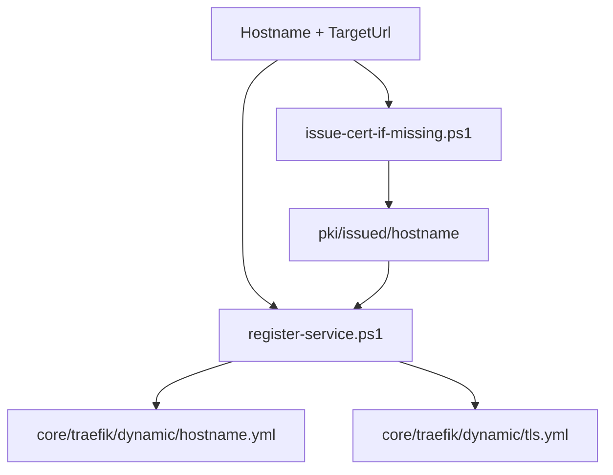

# Service Onboarding Pattern

## Current State

The repository contains scripts to create a Traefik route and, if requested, issue an internal certificate:

- `scripts/new-service.ps1`
- `scripts/issue-cert-if-missing.ps1`
- `scripts/register-service.ps1`

The current model is:

1. The service joins the external Docker network `proxy`.
2. The service exposes an internal endpoint reachable by Traefik.
3. If the backend is HTTPS, an internal certificate is issued.
4. `core/traefik/dynamic/<hostname>.yml` is created or updated.
5. `core/traefik/dynamic/tls.yml` is updated.

Current script limitation: for HTTPS backends, `register-service.ps1` writes a `serversTransport` reference, but it does not write the `serversTransports` block with `rootCAs`. Existing hand-written routes include that block. New HTTPS routes should be reviewed and completed if Traefik needs backend certificate validation.



## Base Command

HTTPS example:

```powershell
.\scripts\new-service.ps1 -Hostname app.internal -TargetUrl https://app:443
```

Example without backend TLS:

```powershell
.\scripts\new-service.ps1 -Hostname app.internal -TargetUrl http://app:80 -NoTls
```

## Implicit Requirements

- Vault must be running and unsealed.
- The PKI engine and `internal-dot` role must exist.
- The Docker network `proxy` must exist.
- The target container must be resolvable by the name used in `TargetUrl`.
- For HTTPS backends, the certificate must match `serverName`.
- For HTTPS backends created by the script, review the generated route for the required `serversTransports` CA configuration.

TODO: document the command to create the `proxy` network if it is not managed elsewhere.

## What the Script Does Not Do

- It does not create the Compose file for the new service.
- It does not configure Vault policy/AppRole for the service.
- It does not create DNS records or hostfile entries.
- It does not validate the application end to end.
