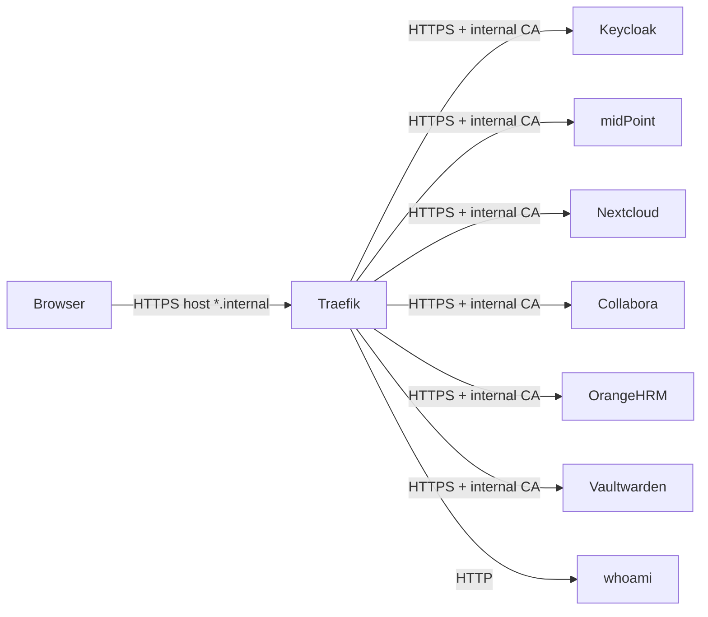

# Traefik and Networking

## Current State

Traefik is defined in `core/traefik/docker-compose.yml` with image `traefik:v3.6`.

Exposed ports:

- `80:80` for HTTP, redirected to HTTPS.
- `443:443` for HTTPS.
- `127.0.0.1:8080:8080` for the local API dashboard.

Static configuration is in `core/traefik/traefik.yml`:

- dashboard enabled.
- `api.insecure: true`, but published only on host loopback by Compose.
- `web` redirects to `websecure`.
- file provider on `/etc/traefik/dynamic`.
- access log on `/var/log/traefik/access.log`.

The Docker network is `proxy`, declared as external.

## Internal Routes

Current routes are in `core/traefik/dynamic/`:

- `auth.internal` to `https://keycloak:8443`.
- `identity.internal` to `https://midpoint:8443`.
- `hr.internal` to `https://orangehrm:443`.
- `files.internal` to `https://nextcloud:443`.
- `office.internal` to `https://collabora:9980`.
- `passwords.internal` to `https://vaultwarden:443`.
- `whoami.internal` to `http://whoami:80`.

For HTTPS backends, dynamic files define a `serversTransport` with:

- `serverName` equal to the internal hostname.
- `rootCAs` pointing to `/pki/ca/internal-ca.crt`.

## Certificates

`core/traefik/dynamic/tls.yml` lists certificates and keys in `/pki/issued/<hostname>/`.

Do not copy certificates or keys into documentation. Document only paths and process.

## Operational Notes

- The Docker provider does not appear to be enabled in `traefik.yml`; therefore Docker labels are not the primary route source.
- `services/vaultwarden/docker-compose.yml` contains Traefik labels, but the model actually configured in core Traefik is file-provider based.
- Routes generated or updated by scripts follow the one-file-per-hostname model.

TODO: document where and how DNS records or hostfile entries are created for `*.internal` names.
