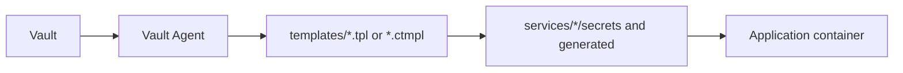

# Vault and Secrets

## Current State

Vault is defined in `core/vault/docker-compose.yml` with image `hashicorp/vault:1.19`.

Current configuration in the repository:

- TCP listener on `0.0.0.0:8200`.
- port published only on `127.0.0.1:8200`.
- Vault listener TLS disabled in the lab.
- file storage in `/vault/file`, mounted from `core/vault/file`.
- Vault UI enabled.
- Docker network `proxy`.

The historical README in `core/vault/README.TXT` documents manual init, manual unseal, login, and KV v2 enablement. The repository does not contain a complete, idempotent Vault bootstrap for auth methods, policies, KV paths, or PKI setup. Do not copy init output, tokens, or unseal keys into documentation.

## Vault Agent

Services use Vault Agent with AppRole:

- `role_id_file_path = /config/role_id`
- `secret_id_file_path = /config/secret_id`
- templates in `/templates`
- destinations in `/secrets` or `/generated`

These credential files are sensitive and must not be copied.

Examples of template output by service:

- Keycloak: TLS, CA, `keycloak.conf`, database credentials.
- midPoint: database password, keystore/truststore passwords, `config.xml`, security policy, Keycloak connector credentials.
- OrangeHRM: database root password.
- Nextcloud: database name, database user, database password, Redis password, initial admin, OIDC client.
- Collabora: TLS, CA, admin credentials.
- Vaultwarden: runtime environment file.

## Internal PKI

The operational scripts assume a Vault PKI engine with role `internal-dot` is available for internal certificate issuance:

- `scripts/issue-cert-if-missing.ps1`
- `scripts/new-service.ps1`
- `scripts/renew-traefik-certs.ps1`

Certificates are saved in `pki/issued/<hostname>/` with files `tls.crt`, `tls.key`, and `ca.crt`.

TODO: document the complete Vault PKI engine bootstrap, including mount, CA, and role, without including sensitive material.

## Target State

Future target: migrate from HashiCorp Vault to OpenBao. See [OpenBao and Valkey notes](openbao-valkey-migration-notes.md) and [ADR 0003](adr/0003-vault-to-openbao-target.md).
